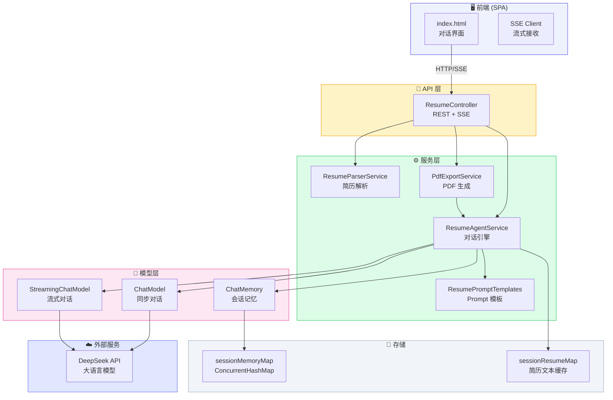

# 简历助手系统架构

## 整体架构



## 分层架构

```
┌─────────────────────────────────────────────┐
│                前  端  (SPA)                  │
│  index.html  ───  SSE Client  ───  marked.js │
├─────────────────────────────────────────────┤
│              API 层  (Spring MVC)             │
│  ResumeController                            │
│  ├── POST /api/resume/upload    (SSE)        │
│  ├── POST /api/resume/chat      (SSE)        │
│  ├── GET  /api/resume/export/{id}            │
│  ├── GET  /api/resume/export/optimized/{id}  │
│  ├── GET  /api/resume/export/pdf/{id}        │
│  ├── GET  /api/resume/templates              │
│  ├── GET  /api/resume/history/{id}           │
│  └── DEL  /api/resume/session/{id}           │
├─────────────────────────────────────────────┤
│              服务层  (Service)                │
│  ResumeParserService    — PDF/Word/MD 解析    │
│  ResumeAgentService     — 对话引擎 + 记忆管理  │
│  PdfExportService       — HTML → PDF 渲染     │
│  ResumePromptTemplates  — Prompt 模板库       │
├─────────────────────────────────────────────┤
│              模型层  (LangChain4j)            │
│  ChatModel             — 同步对话             │
│  StreamingChatModel    — 逐 token 流式        │
│  MessageWindowChatMemory — 滑动窗口记忆        │
├─────────────────────────────────────────────┤
│              外部服务                         │
│  DeepSeek API  (OpenAI 兼容协议)              │
└─────────────────────────────────────────────┘
```

## 核心组件职责

| 组件 | 职责 | 关键技术 |
|------|------|---------|
| **ResumeController** | REST API + SSE 流式推送 | Spring MVC, SseEmitter, VirtualThread |
| **ResumeParserService** | 多格式简历文件解析为纯文本 | PDFBox, Apache POI |
| **ResumeAgentService** | 多轮对话引擎, 会话隔离, 记忆管理 | ChatModel, StreamingChatModel, ChatMemory |
| **PdfExportService** | 简历 Markdown → HTML → 精美 PDF | openhtmltopdf-pdfbox |
| **ResumePromptTemplates** | Agent 人设, 诊断, 优化, 导出, 模板 Prompt | Java Text Block |

## 会话隔离机制

```
用户A ── sessionId_A ──► ChatMemory_A ──► Conversation A
用户B ── sessionId_B ──► ChatMemory_B ──► Conversation B
用户C ── sessionId_C ──► ChatMemory_C ──► Conversation C

     ConcurrentHashMap<String, ChatMemory>
```

每个会话有独立的 `ChatMemory`（滑动窗口 20 条消息）和简历文本缓存，通过 UUID `sessionId` 隔离。

## 技术栈

| 层 | 技术 |
|----|------|
| 框架 | Spring Boot 3.4 + JDK 25 |
| AI 框架 | LangChain4j 1.16.1 |
| 大模型 | DeepSeek (OpenAI 兼容) |
| 简历解析 | PDFBox 3.0, POI 5.4 |
| PDF 生成 | openhtmltopdf 1.1.24 |
| 前端 | 原生 HTML/CSS/JS + marked.js |
| 构建 | Maven |
