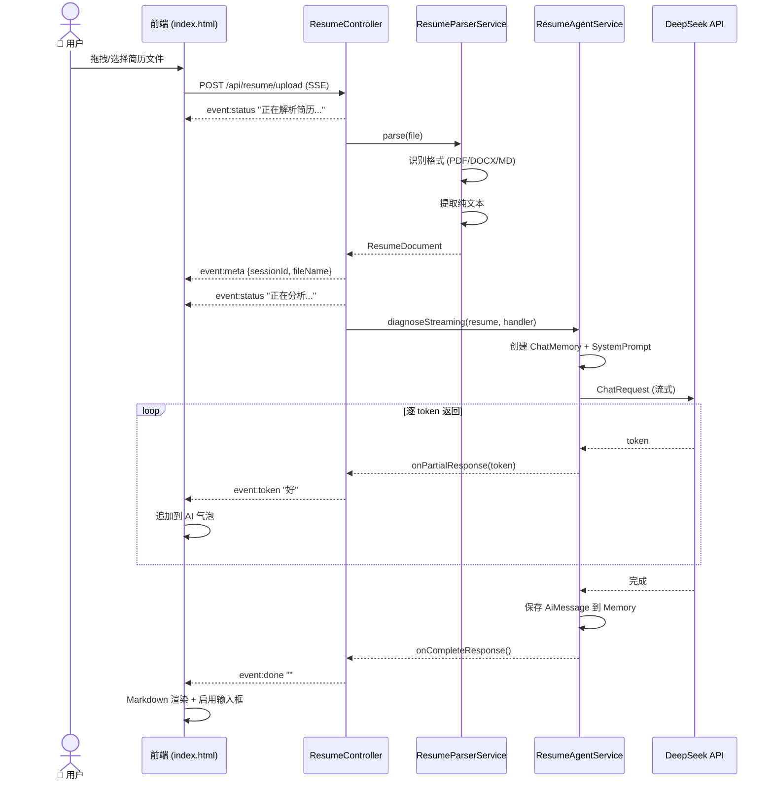
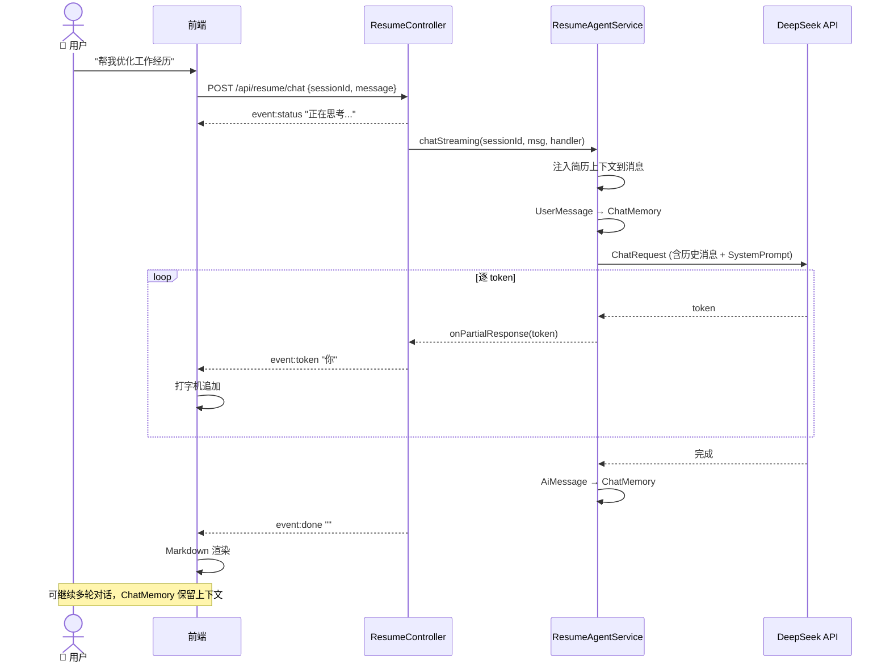
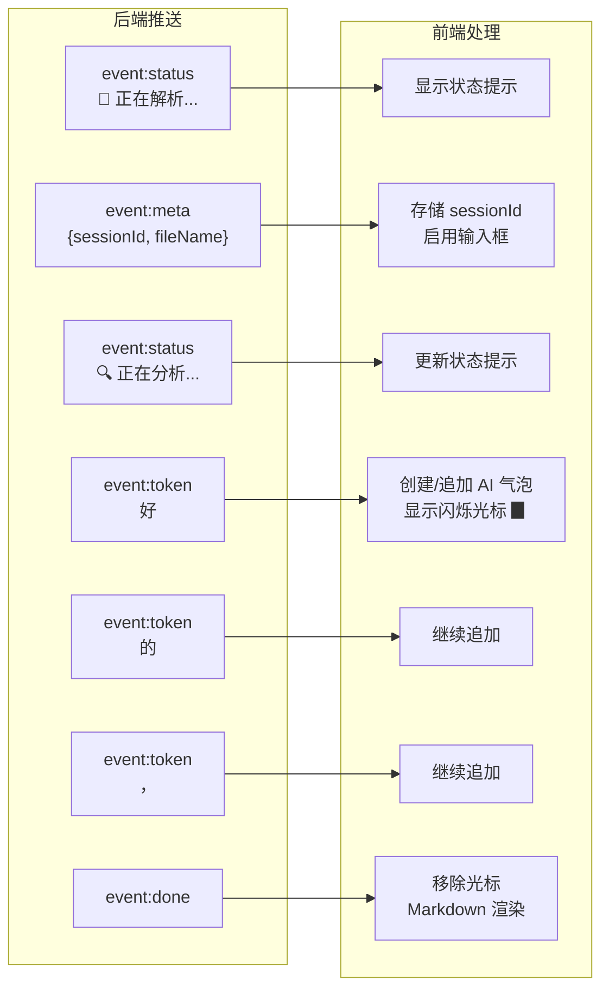
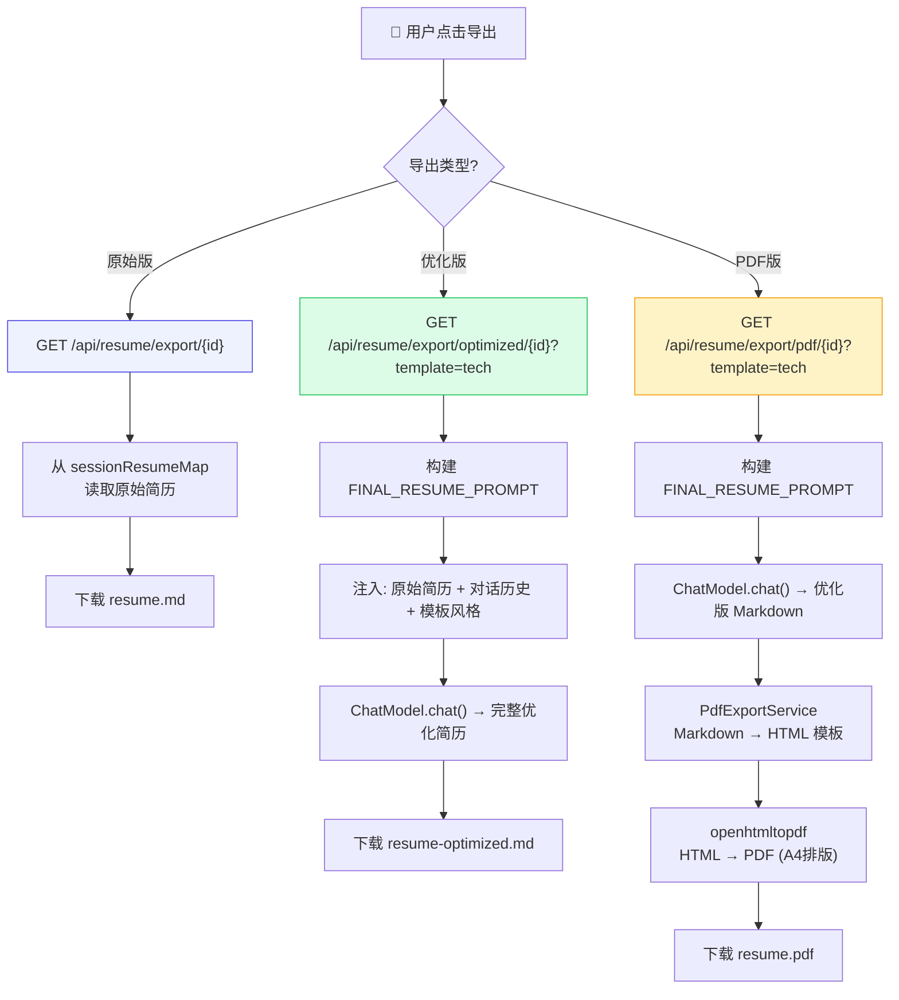
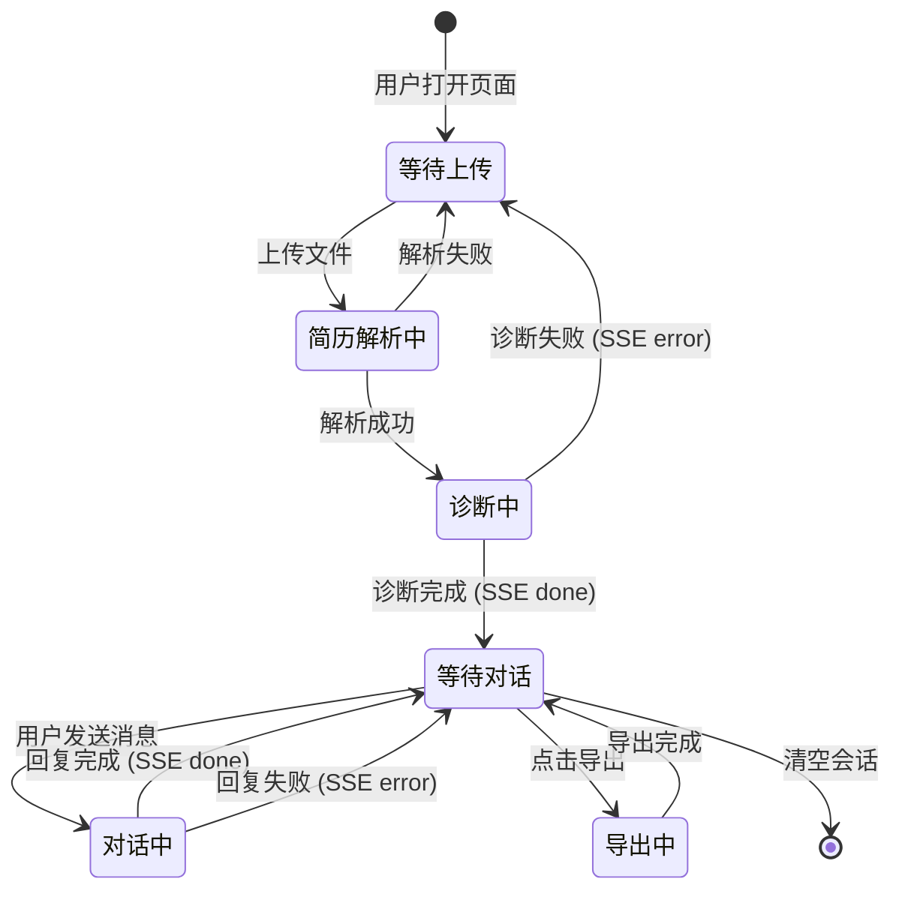
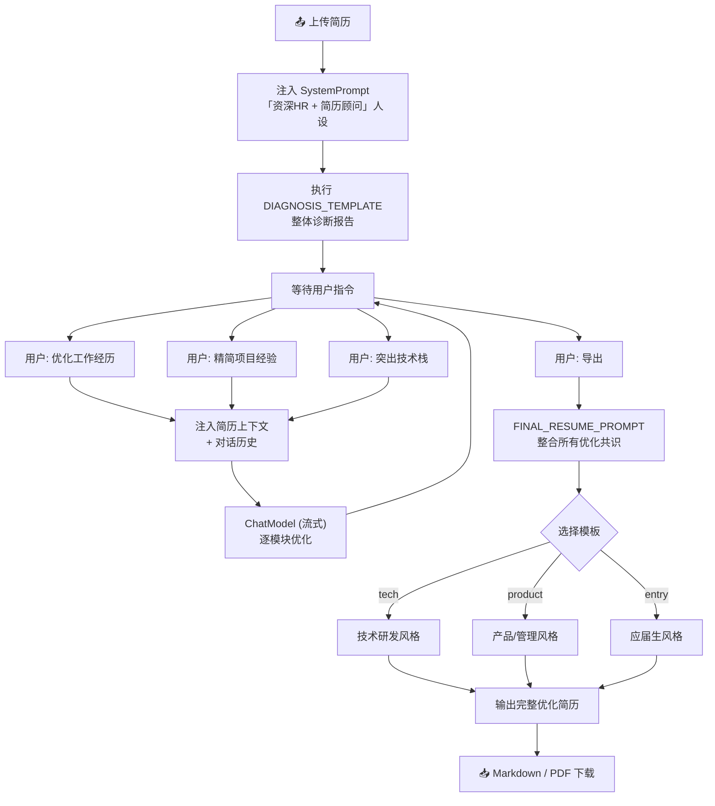

# 核心流程图

## 1. 简历上传 → 自动诊断（完整链路）

```mermaid
sequenceDiagram
    actor User as 👤 用户
    participant UI as 前端 (index.html)
    participant RC as ResumeController
    participant RPS as ResumeParserService
    participant RAS as ResumeAgentService
    participant LLM as DeepSeek API

    User->>UI: 拖拽/选择简历文件
    UI->>RC: POST /api/resume/upload (SSE)
    RC-->>UI: event:status "正在解析简历..."

    RC->>RPS: parse(file)
    RPS->>RPS: 识别格式 (PDF/DOCX/MD)
    RPS->>RPS: 提取纯文本
    RPS-->>RC: ResumeDocument

    RC-->>UI: event:meta {sessionId, fileName}
    RC-->>UI: event:status "正在分析..."

    RC->>RAS: diagnoseStreaming(resume, handler)
    RAS->>RAS: 创建 ChatMemory + SystemPrompt
    RAS->>LLM: ChatRequest (流式)
    
    loop 逐 token 返回
        LLM-->>RAS: token
        RAS-->>RC: onPartialResponse(token)
        RC-->>UI: event:token "好"
        UI->>UI: 追加到 AI 气泡
    end

    LLM-->>RAS: 完成
    RAS->>RAS: 保存 AiMessage 到 Memory
    RAS-->>RC: onCompleteResponse()
    RC-->>UI: event:done ""
    UI->>UI: Markdown 渲染 + 启用输入框
```

## 2. 多轮对话优化

```mermaid
sequenceDiagram
    actor User as 👤 用户
    participant UI as 前端
    participant RC as ResumeController
    participant RAS as ResumeAgentService
    participant LLM as DeepSeek API

    User->>UI: "帮我优化工作经历"
    UI->>RC: POST /api/resume/chat {sessionId, message}
    RC-->>UI: event:status "正在思考..."

    RC->>RAS: chatStreaming(sessionId, msg, handler)
    RAS->>RAS: 注入简历上下文到消息
    RAS->>RAS: UserMessage → ChatMemory
    RAS->>LLM: ChatRequest (含历史消息 + SystemPrompt)

    loop 逐 token
        LLM-->>RAS: token
        RAS-->>RC: onPartialResponse(token)
        RC-->>UI: event:token "你"
        UI->>UI: 打字机追加
    end

    LLM-->>RAS: 完成
    RAS->>RAS: AiMessage → ChatMemory
    RC-->>UI: event:done ""
    UI->>UI: Markdown 渲染

    Note over User,UI: 可继续多轮对话，ChatMemory 保留上下文
```

## 3. SSE 流式协议

```mermaid
graph LR
    subgraph 后端推送
        S1["event:status<br/>📄 正在解析..."]
        S2["event:meta<br/>{sessionId, fileName}"]
        S3["event:status<br/>🔍 正在分析..."]
        S4["event:token<br/>好"]
        S5["event:token<br/>的"]
        S6["event:token<br/>，"]
        S7["event:done<br/>"]
    end

    subgraph 前端处理
        A1["显示状态提示"]
        A2["存储 sessionId<br/>启用输入框"]
        A3["更新状态提示"]
        A4["创建/追加 AI 气泡<br/>显示闪烁光标 ▊"]
        A5["继续追加"]
        A6["继续追加"]
        A7["移除光标<br/>Markdown 渲染"]
    end

    S1 --> A1
    S2 --> A2
    S3 --> A3
    S4 --> A4
    S5 --> A5
    S6 --> A6
    S7 --> A7
```

## 4. 导出流程

```mermaid
flowchart TD
    User[👤 用户点击导出]
    
    User --> Choice{导出类型?}
    
    Choice -->|原始版| MD["GET /api/resume/export/{id}"]
    Choice -->|优化版| OPT["GET /api/resume/export/optimized/{id}?template=tech"]
    Choice -->|PDF版| PDF["GET /api/resume/export/pdf/{id}?template=tech"]

    MD --> Read1["从 sessionResumeMap<br/>读取原始简历"]
    Read1 --> Down1["下载 resume.md"]

    OPT --> Build["构建 FINAL_RESUME_PROMPT"]
    Build --> BuildDetail["注入: 原始简历 + 对话历史 + 模板风格"]
    BuildDetail --> LLM1["ChatModel.chat() → 完整优化简历"]
    LLM1 --> Down2["下载 resume-optimized.md"]

    PDF --> Build2["构建 FINAL_RESUME_PROMPT"]
    Build2 --> LLM2["ChatModel.chat() → 优化版 Markdown"]
    LLM2 --> HTML["PdfExportService<br/>Markdown → HTML 模板"]
    HTML --> Render["openhtmltopdf<br/>HTML → PDF (A4排版)"]
    Render --> Down3["下载 resume.pdf"]

    style MD fill:#eef2ff,stroke:#4f46e5
    style OPT fill:#dcfce7,stroke:#22c55e
    style PDF fill:#fef3c7,stroke:#f59e0b
```

## 5. 会话生命周期

```mermaid
stateDiagram-v2
    [*] --> 等待上传: 用户打开页面
    
    等待上传 --> 简历解析中: 上传文件
    简历解析中 --> 诊断中: 解析成功
    简历解析中 --> 等待上传: 解析失败
    
    诊断中 --> 等待对话: 诊断完成 (SSE done)
    诊断中 --> 等待上传: 诊断失败 (SSE error)
    
    等待对话 --> 对话中: 用户发送消息
    对话中 --> 等待对话: 回复完成 (SSE done)
    对话中 --> 等待对话: 回复失败 (SSE error)
    
    等待对话 --> 导出中: 点击导出
    导出中 --> 等待对话: 导出完成
    
    等待对话 --> [*]: 清空会话
```

## 6. Prompt 策略

```mermaid
flowchart TD
    Upload[📤 上传简历]
    
    Upload --> System["注入 SystemPrompt<br/>「资深HR + 简历顾问」人设"]
    System --> Diag["执行 DIAGNOSIS_TEMPLATE<br/>整体诊断报告"]
    Diag --> Wait["等待用户指令"]
    
    Wait --> Chat1["用户: 优化工作经历"]
    Wait --> Chat2["用户: 精简项目经验"]
    Wait --> Chat3["用户: 突出技术栈"]
    Wait --> Export["用户: 导出"]

    Chat1 --> Context["注入简历上下文<br/>+ 对话历史"]
    Chat2 --> Context
    Chat3 --> Context
    Context --> LLM["ChatModel (流式)<br/>逐模块优化"]
    LLM --> Wait

    Export --> Final["FINAL_RESUME_PROMPT<br/>整合所有优化共识"]
    Final --> Style{选择模板}
    Style -->|tech| Tech["技术研发风格"]
    Style -->|product| Prod["产品/管理风格"]
    Style -->|entry| Entry["应届生风格"]
    Tech --> Output["输出完整优化简历"]
    Prod --> Output
    Entry --> Output
    Output --> Download["📥 Markdown / PDF 下载"]
```
